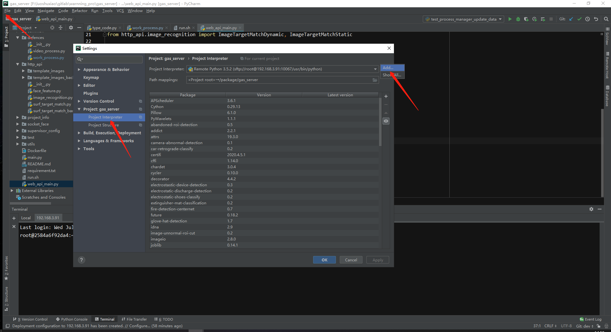
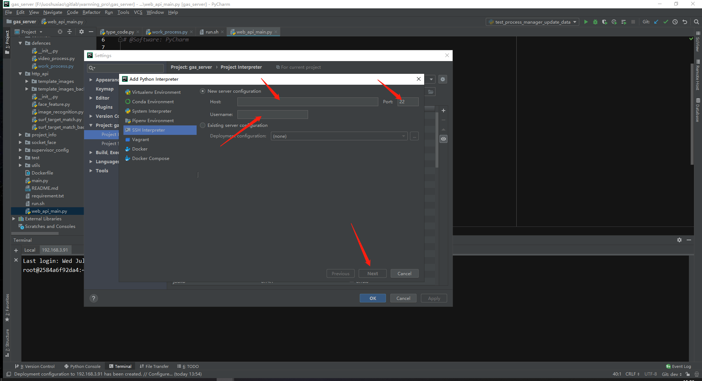
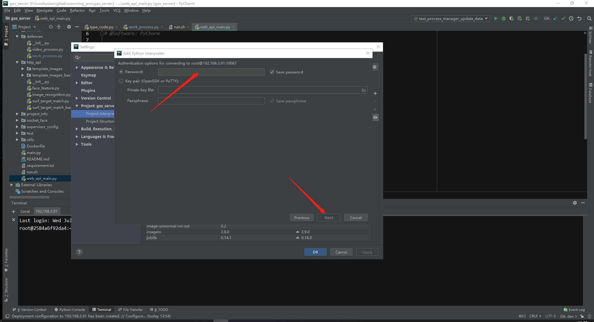
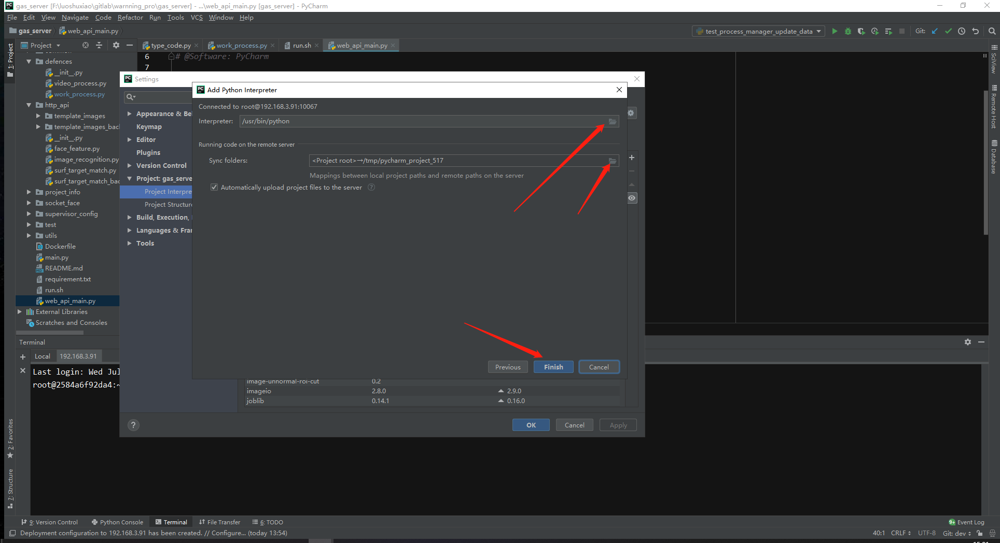
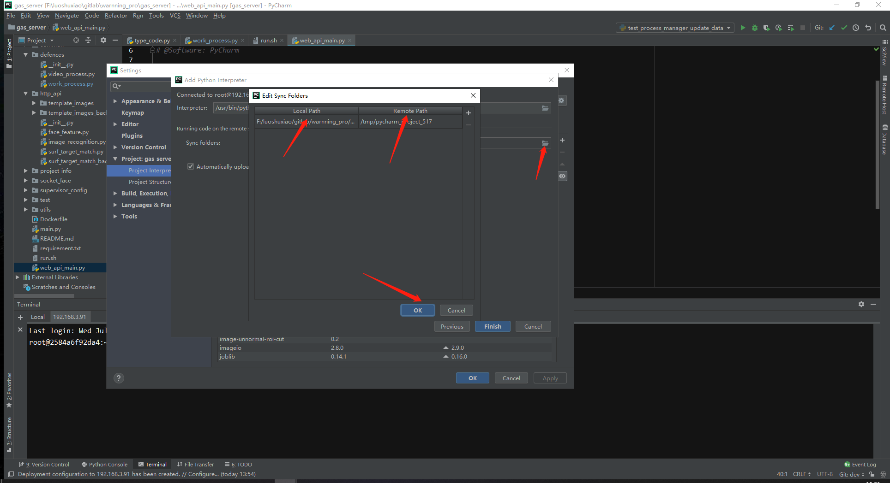
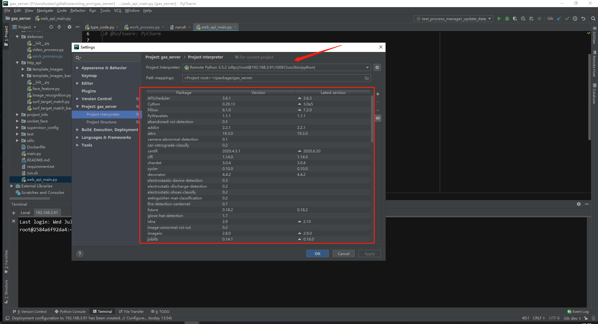
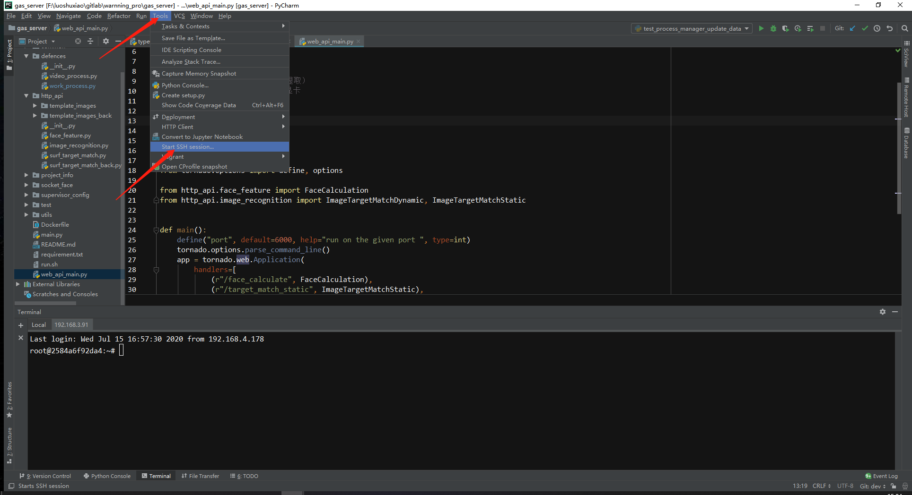
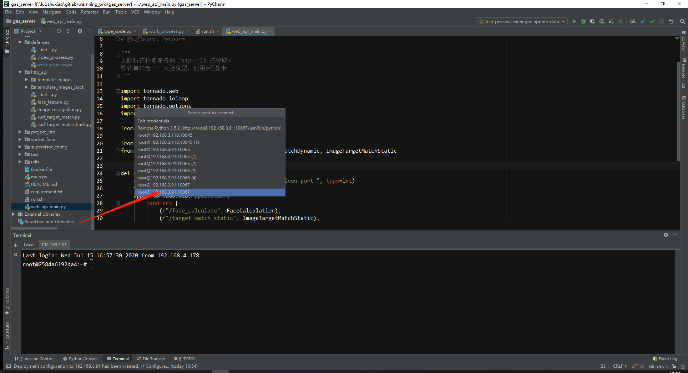
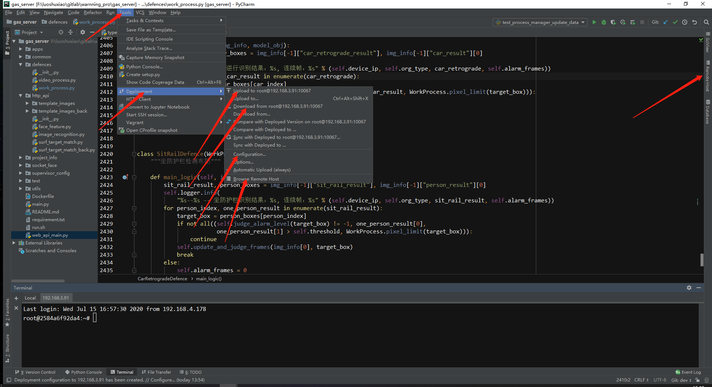

## Pycharm用ssh远程连接docker容器调试项目代码：
	第一： pycharm配置（必须是professional版本，community版本没有远程功能）：
	    往上相关得说明连接： https://blog.csdn.net/hanchaobiao/article/details/84069299
		--> 点击按钮找到配置得地方：  file > settings > project:项目名 > project interpreter > 右上方得齿轮符合（add 新增一个解释器）> SSH interpreter 

		--> 填写远程服务器ip/port等参数： host: 远程服务器ip 
		                                port： 远程服务器得端口（如果用docker容器环境，则端口为docker映射出来得端口,如果用服务器自带得解释器，用ssh端口，即 22）
		                                username: root （docker访问权限必须为root）
		                                三个参数填好后点击 next

		--> 输入密码： password: 容器中设置得ssh访问密码
		              密码填好后点击 next

		--> 配置解释器地址和代码同步地址：
		              interpreter : 点击右边得文件符合配置解释器，选择你需要用得解释器（用docker时一般默认地址即为容器解释器，远程服务器自定义配置得解释器地址需要自己找到解释器地址）
		              sync folders: 点击右边得文件符合配置代码同步地址，左边得local path是 开发机windows本地代码得文件夹地址，一般已经自动路由到项目地址不用更改；
		                            右边得remote path 是远程服务器得地址，需要自己配置，不配置的话ide会自动生成一个文件夹名，存放windows同步到远程服务器得代码；
		                            配置好后点击 ok
		              点击 finish， 如果弹出一个确认是否覆盖文件得确认弹窗，根据需要点击即可 
		              点击 ok ， 即完成连接配置  

		--> 确认是否配置成功, 修改/查看配置, 手动更新本地代码, 本地pycharm查看/操作远程服务器等操作： 
		             确认是否成功： 可以查看 file > settings > project:项目名 > project interpreter 下展示得各种三方库是否与你需要得匹配，或者直接在本地运行下代码试一下
		             本地pycharm查看/操作远程服务器： 点击 tools > start ssh session> 点击需要远程ssh终端连接得服务器地址
                     手动更新本地代码 ： 选中文件/文件夹，点击右键，再点击 deployment > 点击 upload to /download from (上传更新，下载更新)等进行相应操作
                     查看/修改配置： tools > deployment > configuration > 选择要查看/修改得连接，connection是配置，mapping是同步得代码地址
                     查看远程服务器文件目录结构： 点击窗口右边得remote host 或者点击 tools > deployment > browse remote host

	第二 ：docker容器配置：
		--> 运行一个容器： docker run 
		--> 进入容器 docker exec -it 容器名 bash
		--> 修改root密码：passwd
		--> 安装ssh服务（如果没有安装）：apt-get install openssh-server/apt-get install openssh-client
		--> 修改ssh配置文件：vim /etc/ssh/sshd_config :

			# PermitRootLogin prohibit-password # 默认打开禁止root用户使用密码登陆，需要将其注释
			RSAAuthentication yes #启用 RSA 认证
			PubkeyAuthentication yes #启用公钥私钥配对认证方式
			PermitRootLogin yes #允许root用户使用ssh登录

		--> 重启sshd服务：/etc/init.d/ssh restart 

# Docker简单操作：
**Docker是一个为开发者和系统管理员在容器中开发、部署和运行的平台，灵活、轻量级、可互换、部署简单、扩展性极强的容器**
### a. 镜像image和容器container
	镜像是一个包含所有需要运行的文件组成的包，比如代码、可运行文件、库、
        环境变量和配置文件等；
	容器是镜像运行的一个实列，是运行镜像后产生的；
	容器和虚拟机区别：
	容器和进程一样直接在主机操作系统上运行，不占用更多的资源；
	虚拟机直接模拟一个虚拟操作系统，程序实在模拟操作系统里面运行，占用更多资源；

	Docker CE -- 代表社区版本
	Docker EE -- 代表企业版本

## b. 安装docker (最好不要装不稳定版本的docker)
	卸载： 
	apt-get autoremove docker docker-ce docker-engine docker.io containerd runc
	apt-get autoremove docker* 

	安装：
	apt-get update  （更新本地软件包索引）
	apt-get install apt-transport-https ca-certificates curl gnupg-agent software-properties-common （配置存储库）
	
	curl -fsSL https://download.docker.com/linux/ubuntu/gpg | sudo apt-key add -  （添加官方GPG密钥）
	add-apt-repository "deb [arch=amd64] https://download.docker.com/linux/ubuntu $(lsb_release -cs) stable"  （设置存储库类型，稳定版等）
	apt-get update
	apt-cache madison docker-ce  （查看支持的版本）
	apt-get install docker-ce docker-ce-cli containerd.io (最新稳定版，也可指定版本)
    验证是否安装成功： sudo docker run hello-world (出现一堆代码，包含了hello from docker，说明安装并启动成功)

## c. 安装nvidia-docker （即nvidia-container-toolkit插件）
	安装公钥
	curl -s -L https://nvidia.github.io/nvidia-docker/gpgkey | sudo apt-key add -
	获取list
	curl -s -L https://nvidia.github.io/nvidia-docker/ubuntu16.04/nvidia-docker.list | sudo tee /etc/apt/sources.list.d/nvidia-docker.list
	更新
	sudo apt update
	安装nvidia-container-toolkit
	sudo apt install nvidia-container-toolkit
	重启
	sudo systemctl restart docker
    查看docker版本： docker version
	查看docker信息： docker info	

### d. 做一个简单得docker镜像
		第一步： 在docker中运行自己的项目（整体搬迁运行影像）
		**需要Dockerfile进行配置，Dockerfile定义了容器内的环境**
		
		mkdir docker_test  (可以创建在home目录下)
		cd docker_test
		vim Dockerfile # 将下面代码写入Dockerfile(根据项目具体情况设置具体参数)
				
				# Use an official Python runtime as a parent image
				FROM python:2.7-slim
				# Set the working directory to /app
				WORKDIR /app
				# Copy the current directory contents into the container at /app
				ADD . /app
				# Install any needed packages specified in requirements.txt
				RUN pip install -i https://pypi.douban.com/simple -r requirements.txt
				# Make port 80 available to the world outside this container（docker容器内部端口）
				EXPOSE 80
				# Define environment variable
				ENV NAME World
				# Run app.py when the container launches (一般是manage.py)
				CMD ["python", "app.py"]
		vim requirements.txt # 需要导入的pyhton包
		        Flask
		        Redis
		将项目的代码拷贝到docker_test文件夹下（这里的测试的项目代码是 app.py）
		
		第二步：创建docker镜像(最后有一个点符号)
		docker build -t first_docker .
		docker image ls (查看已有镜像或者docker images)
		
		第三步： 重启docker
		service docker restart 或者systemctl restart docker
		
		第四步： 运行容器
		docker run -p 4000:80 first_docker
		
		查看启动的docker容器： docker ps
		停止指定的docker容器： docker container stop 85ac7faf8ea3
                             docker stop  85ac7faf8ea3
        删除指定的容器： docker rm 容器名或id （stop状态）
                       docker rm -rf 容器名或id(运行状态也能删除) 
        进入容器： docker exec -it e1066fe2db35 /bin/bash 
                  docker exec 是docker镜像的连接命令，类似ssh一样
## c. 相关命令
        查看容器详细信息：docker inspect 容器名
        查看已有容器：docker ps (正在运行的)
                    docker ps -a (所有容器，包括停止的)
		镜像打包成tar文件：
		docker save -o <保存路径> <镜像名称:标签>
		docker save -o ./ubuntu18.tar ubuntu:18.04
		
		镜像加载拷贝到服务器中：
		docker load --input ./ubuntu18.tar

		docker容器和宿主机之前的文件拷贝：
        docker cp 宿主机文件路径 容器名：容器内路径
        docker cp 容器名：容器内路径 宿主机文件路径

		容器自动重启：
		docker run --restart=always  （启动容器运行时加always参数）
		docker update --restart=always <CONTAINER ID>（已经运行的容器update）

        查看容器日志：
        docker logs 容器名

        镜像更新/上传/拉取（已配置远程仓库，否则需要docker login登录）：
		  更新命令： docker commit <容器名或id> <镜像名或id:标签>
		  提交命令：docker push <镜像名或id:标签>
		  拉取docker命令： docker pull <镜像名或id:标签>

## d. docker hub仓库 和daocloud镜像仓库
**docker hub是国外的平台，连接速度可能比较慢，所以国内一般在daocloud管理镜像**

	注册daocloud平台：
	
	在daocloud平台注册账号密码，然后创建自己的组织
	
	登录daocolud平台：
	docker login daocloud.io # 输出账号、密码
	
	给要上传云平台的镜像打标签(v1)：
	docker tag first_docker daocloud.io/my_team/first_docker:v1
	上传镜像：
	docker push daocloud.io/my_team/first_docker:v1
	
	从服务器拉取镜像并运行容器：
	docker run --gpus all -p 4000:80 --name test -v /opt:/opt daocolud.io/my_team/seconds_docker:v1
    docker run --gpus all -it -d --privileged=true  -v /package:/package  --name test -p 10022:22  192.168.3.153:5000/lsx:2.0  /bin/bash
    docker run --gpus all -itd --privileged=true  -v /package:/package -v /dev/bus/usb:/dev/bus/usb --name tt  192.168.3.153:5000/lsx:2.0  /bin/bash

## e. 私有仓库（拉取docker ce或者ee版本镜像，在服务器启动、创建私有docker仓库）：

	Docker配置远程仓库地址（访问远程私有仓库）：
             vim /etc/docker/daemon.json 
		将以下代码中的ip改成需要连接的远程仓库地址：
		{"registry-mirrors": ["https://3c9ywpon.mirror.aliyuncs.com"]，"insecure-registries":["192.168.3.153:5000"]}
	    "registry-mirrors"是配置镜像源（国外镜像源网速慢，可配置国内镜像源，阿里镜像源等）；
	    如果有多个私有仓库要链接，将其他私有仓库地址添加到这个json文件"insecure-registries"的值的列表中就行；
	    重启docker -- systemctl restart docker

## f. docker编排管理工具 -- docker-compose
**docker-compose是管理docker多容器应用的工具，可以一个命令启动/管理多个容器**
#### 第一步：安装docker compose: mac或者windows用户是哟个左边版本的docker回默认安装docker-compose；
centos使用： yum -y install docker-compose
ubuntu使用： apt install docker-compose

#### 第二步： 创建项目目录，把项目代码放到该目录，并创建Dockerfile文件；
	FROM python:3.5
	ADD . /project
	WORKDIR /project
	RUN pip install -r requirements.txt
	CMD python main.py

#### 第三步： 在目录下创建编排管理的脚本文件 -- docker-compose.yml 

	version: '2'
	services:
	    web:
		    build: .
		    ports:
		      - "10066:10066"
		    volumes:
		      - /package:/package
		    depends_on:
		      - redis
	    redis:
	        image:redis

### 第三步： 启动docker-compose应用 -- docker-compose up -d

### 相关命令：
	docker-compose stop -- 停止容器
	docker-compose ps  -- 查看容器
	docker-compose run 容器名 命令  -- 让容器运行一个命令
